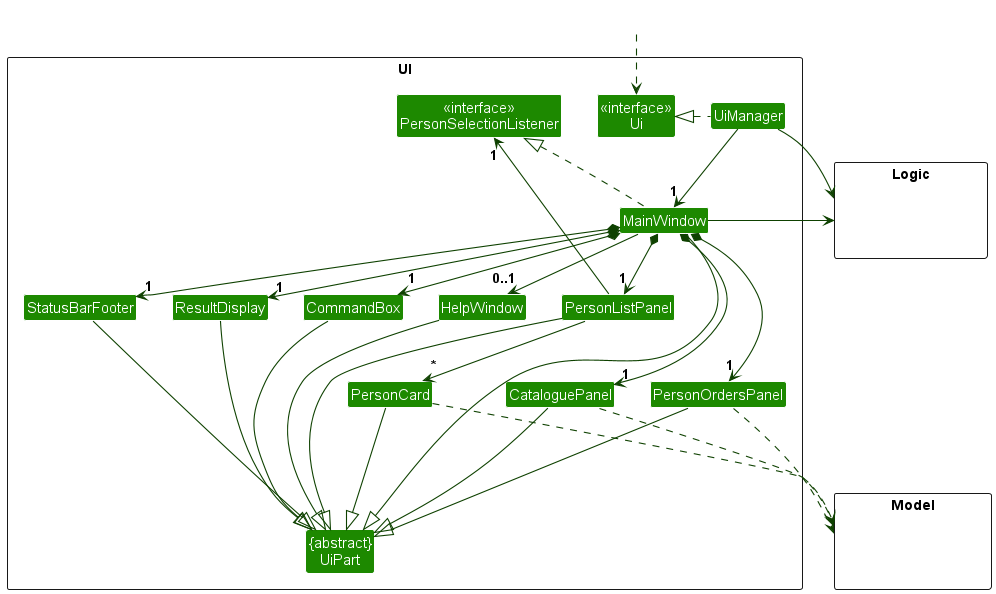
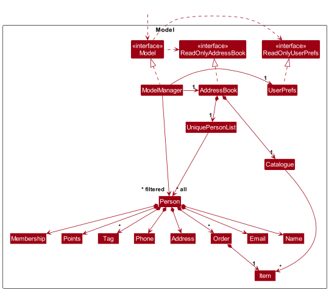
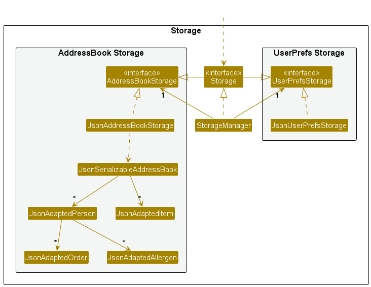
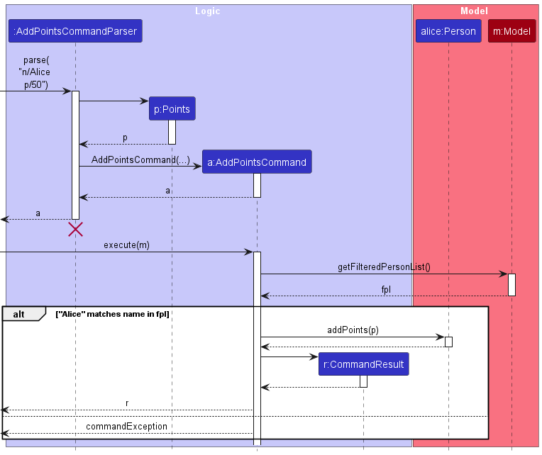
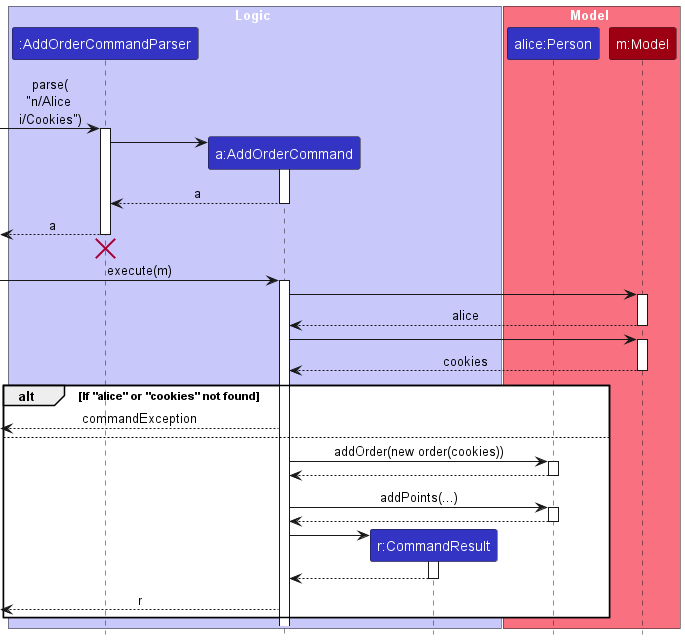

* Table of Contents
{:toc}

--------------------------------------------------------------------------------------------------------------------

## **Acknowledgements**

* The storage of members in SweetRewards was reused with minimal changes from a past project 
AB3 ([nus-cs2103-AY2324S2/tp](https://github.com/nus-cs2103-AY2324S2/tp))
* The commands `addmem`, `clear`, `delmem`, `find`, `list`, `help` were reused with some changes from the previously-mentioned
AB3 ([nus-cs2103-AY2324S2/tp](https://github.com/nus-cs2103-AY2324S2/tp))
* Code introduced in both `main` and `test` codebase, as well as JavaDocs were produced with the aid of [GitHub Copilot](https://github.com/features/copilot),
an AI developer tool.

--------------------------------------------------------------------------------------------------------------------

## **Setting up, getting started**

Refer to the guide [_Setting up and getting started_](SettingUp.md).

--------------------------------------------------------------------------------------------------------------------

## **Design**

:bulb: **Tip:** The `.puml` files used to create diagrams in this document `docs/diagrams` folder. Refer to the [_PlantUML Tutorial_ at se-edu/guides](https://se-education.org/guides/tutorials/plantUml.html) to learn how to create and edit diagrams.

### Architecture

The ***Architecture Diagram*** given above explains the high-level design of the App.

Given below is a quick overview of main components and how they interact with each other.

**Main components of the architecture**

**`Main`** (consisting of classes [`Main`](https://github.com/AY2324S2-CS2103T-T13-4/tp/blob/master/src/main/java/seedu/address/Main.java) and [`MainApp`](https://github.com/AY2324S2-CS2103T-T13-4/tp/blob/master/src/main/java/seedu/address/MainApp.java)) is in charge of the app launch and shut down.
* At app launch, it initializes the other components in the correct sequence, and connects them up with each other.
* At shut down, it shuts down the other components and invokes cleanup methods where necessary.

The bulk of the app's work is done by the following four components:

* [**`UI`**](#ui-component): The UI of the App.
* [**`Logic`**](#logic-component): The command executor.
* [**`Model`**](#model-component): Holds the data of the App in memory.
* [**`Storage`**](#storage-component): Reads data from, and writes data to, the hard disk.

[**`Commons`**](#common-classes) represents a collection of classes used by multiple other components.

**How the architecture components interact with each other**

The *Sequence Diagram* below shows how the components interact with each other for the scenario where the user issues the command `delmem 1`.

Each of the four main components (also shown in the diagram above),

* defines its *API* in an `interface` with the same name as the Component.
* implements its functionality using a concrete `{Component Name}Manager` class (which follows the corresponding API `interface` mentioned in the previous point.

For example, the `Logic` component defines its API in the `Logic.java` interface and implements its functionality using the `LogicManager.java` class which follows the `Logic` interface. Other components interact with a given component through its interface rather than the concrete class (reason: to prevent outside component's being coupled to the implementation of a component), as illustrated in the (partial) class diagram below.

The sections below give more details of each component.

### UI component

The **API** of this component is specified in [`Ui.java`](https://github.com/AY2324S2-CS2103T-T13-4/tp/blob/master/src/main/java/seedu/address/ui/Ui.java)

The UI consists of a `MainWindow` that is made up of parts e.g.`CommandBox`, `ResultDisplay`, `PersonListPanel`, `StatusBarFooter` etc. All these, including the `MainWindow`, inherit from the abstract `UiPart` class which captures the commonalities between classes that represent parts of the visible GUI.

Notably, the `MainWindow` also consists of two side panels `CataloguePanel` and `PersonOrdersPanel` which displays the `Catalogue` of the SweetRewards, and the orders of the selected person respectively.

`MainWindow` implements the `PersonSelectionListener` interface, and listens to when a `PersonCard` is clicked in the `PersonListPanel`. It then tells `PersonOrdersPanel` to update the orders displayed.

The `UI` component uses the JavaFx UI framework. The layout of these UI parts are defined in matching `.fxml` files that are in the `src/main/resources/view` folder. For example, the layout of the [`MainWindow`](https://github.com/se-edu/addressbook-level3/tree/master/src/main/java/seedu/address/ui/MainWindow.java) is specified in [`MainWindow.fxml`](https://github.com/se-edu/addressbook-level3/tree/master/src/main/resources/view/MainWindow.fxml)

The `UI` component,
* executes user commands using the `Logic` component.
* listens for changes to `Model` data so that the UI can be updated with the modified data.
* keeps a reference to the `Logic` component, because the `UI` relies on the `Logic` to execute commands.
* depends on some classes in the `Model` component, as it displays `Person` object residing in the `Model`.

### Logic component

**API** : [`Logic.java`](https://github.com/AY2324S2-CS2103T-T13-4/tp/blob/master/src/main/java/seedu/address/logic/Logic.java)

Here's a (partial) class diagram of the `Logic` component:

The sequence diagram below illustrates the interactions within the `Logic` component, taking `execute("delmem 1")` API call as an example.

:information_source: **Note:** The lifeline for `DeleteCommandParser` should end at the destroy marker (X) but due to a limitation of PlantUML, the lifeline continues till the end of diagram.

How the `Logic` component works:

1. When `Logic` is called upon to execute a command, it is passed to an `AddressBookParser` object which in turn creates a parser that matches the command (e.g., `DeleteCommandParser`) and uses it to parse the command.
1. This results in a `Command` object (more precisely, an object of one of its subclasses e.g., `DeleteCommand`) which is executed by the `LogicManager`.
1. The command can communicate with the `Model` when it is executed (e.g. to delete a person). 
   Note that although this is shown as a single step in the diagram above (for simplicity), in the code it can take several interactions (between the command object and the `Model`) to achieve.
1. The result of the command execution is encapsulated as a `CommandResult` object which is returned back from `Logic`.

Here are the other classes in `Logic` (omitted from the class diagram above) that are used for parsing a user command:

How the parsing works:
* When called upon to parse a user command, the `AddressBookParser` class creates an `XYZCommandParser` (`XYZ` is a placeholder for the specific command name e.g., `AddCommandParser`) which uses the other classes shown above to parse the user command and create a `XYZCommand` object (e.g., `AddCommand`) which the `AddressBookParser` returns back as a `Command` object.
* All `XYZCommandParser` classes (e.g., `AddCommandParser`, `DeleteCommandParser`, ...) inherit from the `Parser` interface so that they can be treated similarly where possible e.g, during testing.

### Model component
**API** : [`Model.java`](https://github.com/AY2324S2-CS2103T-T13-4/tp/blob/master/src/main/java/seedu/address/model/Model.java)

The `Model` component,

* stores the SweetRewards data i.e., all `Person` objects (which are contained in a `UniquePersonList` object) and the items for sale (which are contained in a `Catalogue` object).
* stores the currently 'selected' `Person` objects (e.g., results of a search query) as a separate _filtered_ list which is exposed to outsiders as an unmodifiable `ObservableList<Person>` that can be 'observed' e.g. the UI can be bound to this list so that the UI automatically updates when the data in the list change.
* stores a `UserPref` object that represents the user’s preferences. This is exposed to the outside as a `ReadOnlyUserPref` objects.
* does not depend on any of the other three components (as the `Model` represents data entities of the domain, they should make sense on their own without depending on other components)

### Storage component

**API** : [`Storage.java`](https://github.com/AY2324S2-CS2103T-T13-4/tp/blob/master/src/main/java/seedu/address/storage/Storage.java)

The `Storage` component,
* can save both address book data and user preference data in JSON format, and read them back into corresponding objects.
* inherits from both `AddressBookStorage` and `UserPrefStorage`, which means it can be treated as either one (if only the functionality of only one is needed).
* depends on some classes in the `Model` component (because the `Storage` component's job is to save/retrieve objects that belong to the `Model`)

### Common classes

Classes used by multiple components are in the `seedu.addressbook.commons` package.

--------------------------------------------------------------------------------------------------------------------

## **Implementation**

This section describes some noteworthy details on how certain features are implemented.

### Points feature
The `addpoints` command that comes along with the points feature is implemented like this:

### Orders feature
The `addorder` command that comes along with the orders feature is implemented like this:

#### Proposed Implementation

--------------------------------------------------------------------------------------------------------------------

## **Documentation, logging, testing, configuration, dev-ops**

* [Documentation guide](Documentation.md)
* [Testing guide](Testing.md)
* [Logging guide](Logging.md)
* [Configuration guide](Configuration.md)
* [DevOps guide](DevOps.md)

--------------------------------------------------------------------------------------------------------------------

## **Appendix: Requirements**

### Product scope

**Target user profile**:

* Is a small-medium scale bakery owner
* Has a need to manage a significant number of patrons' membership details
* Want to keep track of points for each member and can easily allow accumulation and redemption of points
* Prefer desktop apps over other types
* Can type fast
* Prefers typing to mouse interactions
* Is reasonably comfortable using CLI apps

**Value proposition**: manage membership subscriptions for a small-medium bakery shop faster than a typical mouse/GUI driven app

### User stories

Priorities: Exists (Exists in this version), High (must have) - `* * *`, Medium (nice to have) - `* *`, Low (unlikely to have) - `*`

| Priority | As a …​                                             | I want to …​                                                                                             | So that I can…​                                                            |
|----------|-----------------------------------------------------|----------------------------------------------------------------------------------------------------------|----------------------------------------------------------------------------|
| `Exists` | Potential user exploring the app                    | See the app populated with sample data                                                                   | I can easily see how the app will look like when it is in use              |
| `Exists` | Potential user exploring the app                    | Access the user guide easily via a help button                                                           |                                                                            |
| `Exists` | User ready to start using the app                   | Purge all current data                                                                                   | I can get rid of the sample data and input my own                          |
| `Exists` | User learning to use the app                        | Add a new member                                                                                         |                                                                            |
| `Exists` | User learning to use the app                        | Check whether a particular member exists                                                                 | I can verify if a patron is a member or not                                |
| `Exists` | User learning to use the app                        | Manually add points to a member                                                                          | I can reward them for their patronage                                      |
| `Exists` | User learning to use the app                        | Manually subtract points from a member                                                                   | The members can "spend" their points for discounts                         |
| `Exists` | User learning to use the app                        | Save all data on every command that changes the data                                                     | Closing the application (intended or not) will not lose my data            |
| `Exists` | User learning to use the app                        | See help on proper usage when I wrongly use a command                                                    | Easily learn and correct my mistakes                                       |
| `Exists` | User slightly familiar with the app                 | Add orders to a particular member (saves current date/time)                                              | I can track their past orders                                              |
| `Exists` | User slightly familiar with the app                 | Edit member details                                                                                      | When patrons change their name, address or contact, I can easily update it |
| `Exists` | User slightly familiar with the app                 | Delete members                                                                                           | I can remove a member from my list when they are not longer subscribed.    |
| `Exists` | User who likes to be organised                      | Create tags containing allergen information that can be attached to members                              | I can categorise members for different discounts etc.                      |
| `Exists` | User who likes to be organised                      | Search for a member and see and overview of their profile                                                | I can see and easily refer to their important details                      |
| `* *`    | User looking to develop the business                | Count the number of members with a certain Tag                                                           | Make business decisions easier by observing my demographics                |
| `Exists` | User looking to develop the business                | Check the past orders of a member                                                                        | I can refer back to past orders for marketing/accounting purposes          |
| `Exists` | User with many orders                               | Create and add to a list of products, with the respective points they each reward when bought            | I can input multiple orders quickly                                        |
| `Exists` | User with many orders                               | Add an order to a member which automatically adds points using one single command                        | I can input multiple orders quickly                                        |
| `* *`    | User looking to be more efficient                   | Add an order to a member which automatically adds points, and can redeem points using one single command | I can input multiple orders even quicker                                   |
| `* *`    | User looking to be more efficient                   | Use all points from a member with a feedback to let me know how many was used                            | I can add orders without even looking at how many points a member has      |
| `* *`    | User looking to expand the business                 | Create membership tiers that increase the amount of points earned                                        | I can expand my loyalty program                                            |
| `Exists` | User looking to expand the business                 | Separate members into different tiers manually                                                           | I can expand my loyalty program                                            |
| `Exists` | User looking to expand the business                 | Create different redemptions using points other than flat discounts (Eg. free small cake)                | I can expand my loyalty program                                            |
| `*`      | User looking for more complex membership structures | Create membership tiers using pre-built structures that define prerequisites for a tier                  | Automate the process of "tiering up"                                       |
| `Exists` | User looking for more complex membership structures | Have members automatically "tier up" when they hit the prerequisites for a tier                          | Automate the process of "tiering up"                                       |
| `*`      | User looking for more complex membership structures | Have points have an expiry date that I can decide on                                                     | Encourage patrons to spend their points by buying something                |
| `*`      | User looking for more complex membership structures | Automatically SMS members when their points expire soon                                                  | Encourage patrons to spend their points by buying something                |
| `*`      | User looking for more complex membership structures | Be able to send out announcements via SMS                                                                | Increase advertising to members                                            |
| `* *`    | Experienced User who is organised                   | Split the graphical interface into different sections containing members of different tiers              | Have an overview of the members in the different tiers                     |
| `* *`    | Experienced User who is organised                   | See how many members of each tier there is                                                               | I can understand how my loyalty system is doing                            |

*{More to be added}*

### Use cases

(For all use cases below, the **System** is the `SweetRewards` and the **Actor** is the `user`, unless specified otherwise)

**Use case 1: Delete a member**

**MSS**

1.  User requests to list customers
2.  SweetRewards shows a list of customers
3.  User requests to delete a specific customer in the list
4.  AddressBook deletes the customer

    Use case ends.

**Extensions**

* 2a. The list is empty.

  Use case ends.

* 3a. The given index is invalid.

    * 3a1. SweetRewards shows an error message.

      Use case resumes at step 2.

**Use case 2: Add a member**

**MSS**

1.  User requests to add a customer by typing the command `addmem`
2.  SweetRewards shows member added successfully
3.  User can view added member successfully

    Use case ends.

**Extensions**

* 2a. The compulsory fields are empty

    * 2a1. SweetRewards shows an error message.

      Use case resumes at step 2.

**Use case 3: Add an order for a member**

**MSS**

1.  User requests to add a order to a member by typing the command `addorder`
2.  SweetRewards shows order added successfully
3.  User can view the order that was added to the member successfully

    Use case ends.

**Extensions**

* 2a. The compulsory fields are empty

    * 2a1. SweetRewards shows an error message.

      Use case resumes at step 2.

**Use case 4: Redeem points for a member**

**MSS**

1.  User requests to delete "x" number of points for a member by
typing the command `redeempts`
2.  SweetRewards shows "x" points redeemed for member
3.  User can see that the member has "x" lesser points

    Use case ends.

**Extensions**

* 2a. The current number of points is less than "x"

    * 2a1. SweetRewards shows an error message.

      Use case resumes at step 2.

*{More to be added}*

### Non-Functional Requirements

#### Usability
1.  Should work on any _mainstream OS_ as long as it has Java `11` or above installed.
2.  Should operate efficiently in a small business' technical environment i.e. should require minimal hardware resources.

#### Performance:
1.  Should be able to hold up to 1000 persons without a noticeable sluggishness in performance for typical usage.
2.  A user with above average typing speed for regular English text (i.e. not code, not system admin commands) should be able to accomplish most of the tasks faster using commands than using the mouse.
3.  Ensure that all commands are executed and feedback is provided within 2 seconds during normal operation.

#### Accessibility:
1.  Should support users with different abilities to effectively interact with the system.

#### Security:
1.  Data stored should not be easily modified by non-authorised users of the application.

### Glossary

* **Mainstream OS**: Windows, Linux, Unix, MacOS

--------------------------------------------------------------------------------------------------------------------

## **Appendix: Instructions for manual testing**

Given below are instructions to test the app manually.

:information_source: **Note:** These instructions only provide a starting point for testers to work on;
testers are expected to do more *exploratory* testing.

### Launch and shutdown

1. Initial launch

   1. Download the jar file and copy into an empty folder

   1. Double-click the jar file 
      Expected: Shows the GUI with a set of sample contacts. The window size may not be optimum.

1. Saving window preferences

   1. Resize the window to an optimum size. Move the window to a different location. Close the window.

   1. Re-launch the app by double-clicking the jar file. 
       Expected: The most recent window size and location is retained.

1. Shutdown of application

   1. Enter `exit` into the command box OR click on the `X` button on the top-right hand corner of the window.
       Expected: The application should close with no other obstructions.

### Deleting a person

1. Deleting a person

   1. Test case: `delmem 1` 
      Expected: First contact is deleted from the list. Details of the deleted contact shown in the status message. Timestamp in the status bar is updated.

   1. Test case: `delmem 0` 
      Expected: No person is deleted. Error details shown in the status message. Status bar remains the same.

   1. Other incorrect delete commands to try: `delmem`, `delmem x`, `...` (where x is larger than the list size) 
      Expected: Similar to previous.

### Saving data

1. Dealing with missing/corrupted data files

   1. Prerequisites:
      1. Launch the application.
      2. Enter the command `clear --force` into the command box.
          WARNING: This will clear all existing data from the application which you will not get back!
      3. Enter the command `seeddata` into the command box.
      4. Exit the application.
   
   2. From the same directory as the application, open the `data` directory, then `addressbook.json` in your preferred editor 
   3. Remove line 8 (`"points" : "0",`) from the file.
   4. Re-launch the application.  
      Expected: Application should open with no visible contacts and items

--------------------------------------------------------------------------------------------------------------------

## **Appendix: Effort**

- Our project expanded to include more than one entity type. Namely, we added the `Item` entity type, which stores the
name and points per quantity for each item stored in the application.
  

- Multiple new fields were implemented to store additional information for each `Person` entity:
    - `Points`: stores the redeemable points which the member currently has. (By Kinjal)
    - `MembershipTier`: stores the current membership tier of the member. (By Khushi)
      - Later repurposed to `MembershipPoints`, after we noticed it was easier for the application to instead keep track of the
        cumulative points of the member. (By Kok Liang)
    - `Orders`: stores the previous orders (as Strings) which were made by the member. (By Billy)
      - Later enhanced to store `Item` entities.
    - Each additional field required fixing existing code which used the `Person` entity. This includes:
      - `Person` constructors
      - All/most commands which involve members e.g. `addmem`, `editmem`
      - Existing JSON storage files for testing
    - Hence, adding these fields introduced additional levels of complexity to our application.
