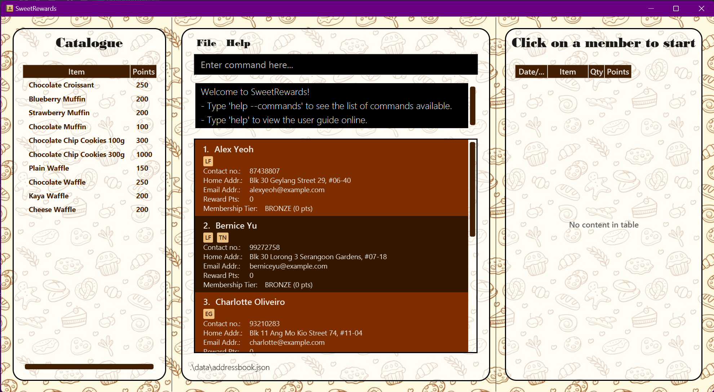
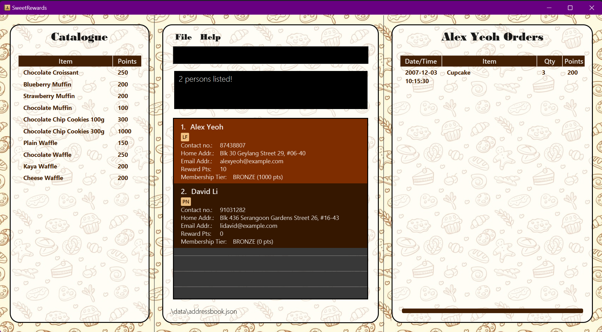
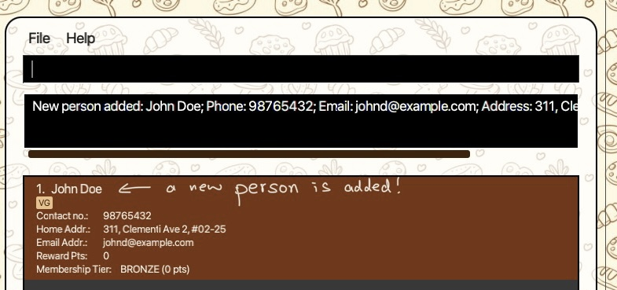
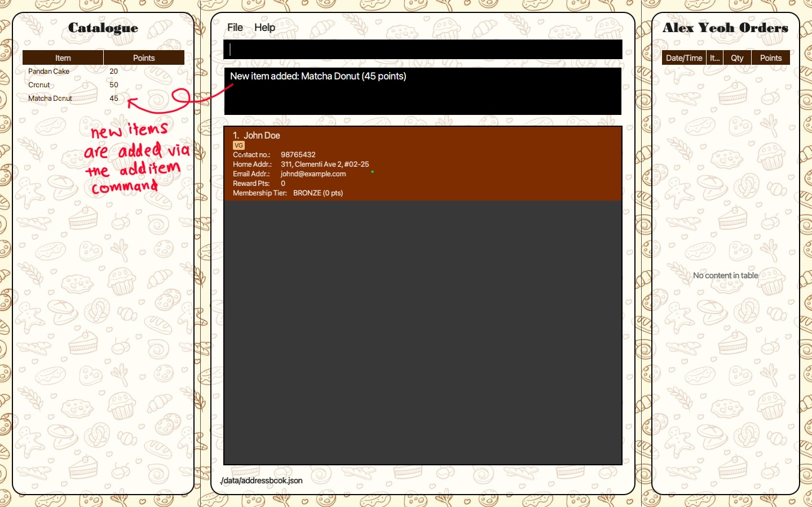
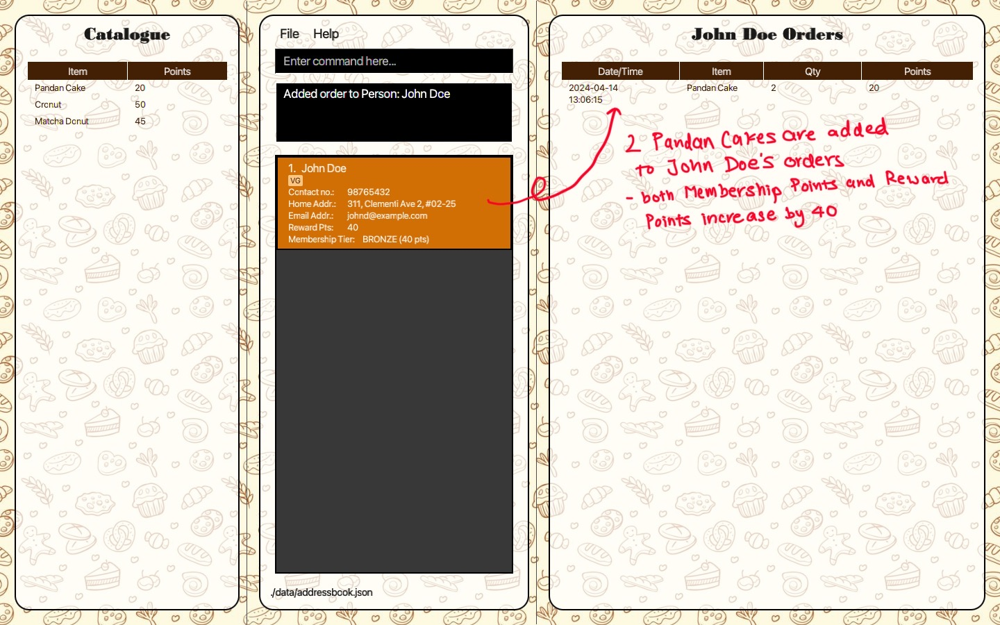
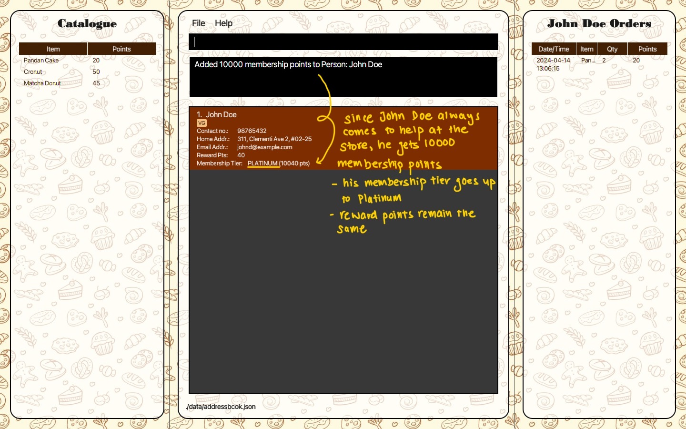
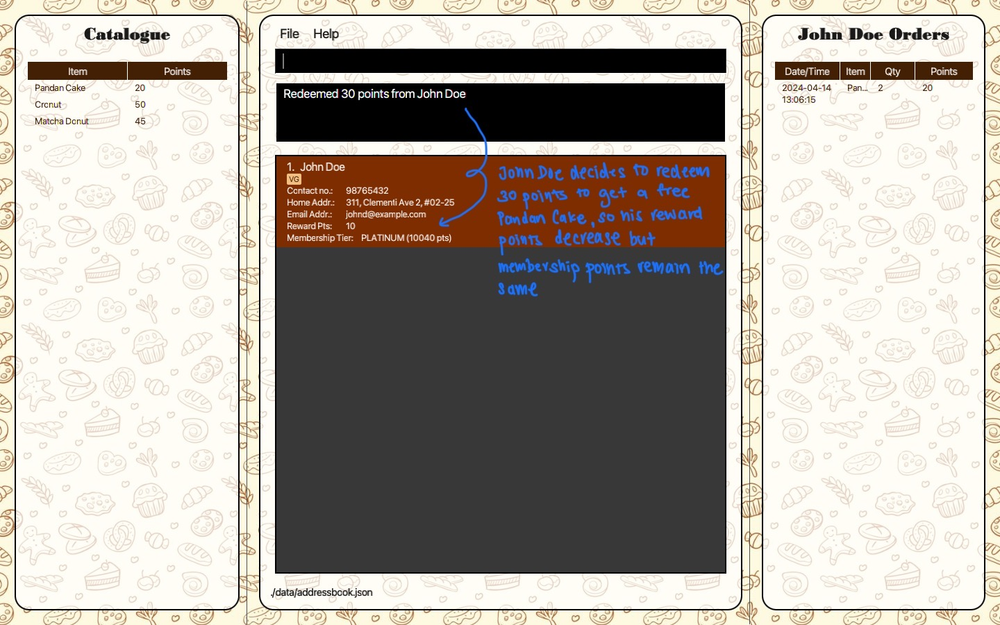
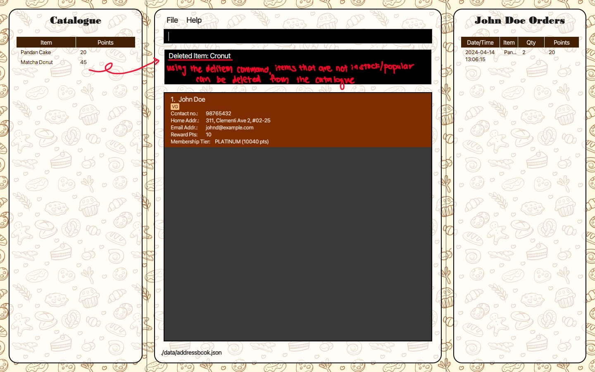

## Table of Contents

1. [Introduction](#1-introduction) 
   1.1 [Target Audience](#11-target-audience) 
   1.2 [Purpose of this Guide](#12-purpose-of-this-guide) 
   1.3 [Getting Started with SweetRewards](#13-getting-started-with-sweetrewards) 
   1.4 [Navigating this Guide](#14-navigating-this-guide)
2. [About SweetRewards](#2-about-sweetrewards) 
   2.1 [Understanding Membership Tiers and Points System](#21-understanding-membership-tiers-and-points-system) 
3. [Getting Started](#3-getting-started) 
4. [Features](#4-features) 
   4.1 [Viewing help](#41-viewing-help--help) 
   4.2 [Initializing program with seed data](#42-initializing-program-with-seed-data--seeddata) 
   4.3 [Adding a Member](#43-adding-a-member--addmem) 
   4.4 [Listing all members](#44-listing-all-members--list) 
   4.5 [Adding a new Item to the Catalogue](#45-adding-an-item-to-the-catalogue--additem) 
   4.6 [Deleting an Item from the Catalogue](#46-deleting-an-item-from-the-catalogue--delitem) 
   4.7 [Adding Orders to a member](#47-adding-orders-to-a-member--addorder) 
   4.8 [Adding points to a member](#48-adding-points--addpoints) 
   4.9 [Redeeming Points](#49-redeeming-points--redeempoints) 
   4.10 [Updating Membership Tiers](#410-updating-membership--addmship) 
   4.11 [Editing a member's details](#411-editing-a-member--edit) 
   4.12 [Locating a member by name](#412-locating-members-by-name--find) 
   4.13 [Deleting a member](#413-deleting-a-member--delmem) 
   4.14 [Clearing all entries](#414-clearing-all-entries--clear) 
   4.15 [Exiting the program](#415-exiting-the-program--exit) 
   4.16 [Saving the data](#416-saving-the-data) 
   4.17 [Editing the data file](#417-editing-the-data-file) 
   4.18 [Archiving data files](#418-archiving-data-files) 
5. [Example Tutorial](#5-tutorial) 
6. [Glossary](#6-glossary) 
7. [FAQs](#7-faq) 
8. [Troubleshooting](#8-troubleshooting) 
9. [Command Summary](#9-command-summary) 
10. [Planned Enhancements](#10-planned-enhancements) 

# 1. Introduction
Welcome to the SweetRewards User Guide! This guide is your comprehensive manual to navigating and maximizing the SweetRewards application. [SweetRewards](#2-about-sweetrewards) is a dynamic desktop application designed for small bakery owners to **manage their loyalty program memberships** efficiently. By leveraging the robustness of a **[Command Line Interface](#6-glossary)** while retaining the intuitive nature of a Graphical User Interface (GUI), SweetRewards delivers an optimized experience for fast typers and GUI enthusiasts alike.

## 1.1 Target Audience
This guide is intended for **small to medium-sized bakery owners** or staff responsible for managing **customer relationships and loyalty programs**. We assume that users have a basic understanding of command-line interfaces and desktop applications but **do not require advanced technical skills**. SweetRewards is crafted to simplify your membership tracking, offering a seamless integration into your daily operations.

## 1.2 Purpose of this Guide
The purpose of this User Guide is to assist you in understanding and utilizing the SweetRewards application to its fullest potential. Whether you are looking to onboard new members, track orders, manage reward points or update [Membership Tiers](#6-glossary) this guide will provide step-by-step instructions to ensure a smooth experience.

## 1.3 Getting Started with SweetRewards
To begin using SweetRewards, ensure that your device meets the **software’s compatibility requirements**. Follow the installation instructions provided under [Getting Started](#3-getting-started). After installation, familiarize yourself with the GUI elements and practice basic [Command Line Interface](#6-glossary) commands through the introductory tutorial.

## 1.4 Navigating this Guide
This User Guide is structured to help you find information quickly and easily. Use the table of contents to navigate to specific sections. Throughout the guide, you’ll find tips, warnings, and best practices highlighted to draw your attention to important information. If you’re new to [Command Line Interface](#6-glossary), refer to the section on [Command Line Interface](#6-glossary) usage for an explanation of commands and syntax.

By following this guide, you’ll learn how to leverage SweetRewards effectively, ensuring that your bakery’s loyalty program runs smoothly and your customers remain happy and engaged. Let’s get started on making the most out of your SweetRewards experience!

Throughout the guide, you'll encounter various icons that signify different types of information:

💡 **Tip**: This icon indicates a tip, suggestion, or piece of advice to help you use SweetRewards more effectively.

⚠️ **Warning**: This icon alerts you to potential pitfalls or actions that could negatively impact your use of the application.

🌟 **Benefit**: This icon signifies key benefits and positive outcomes from using a feature within SweetRewards.

🚫 **Problem**: Identifies common challenges or issues you may encounter.

✅ **Solution**: Provides answers or solutions to the problems presented.

Use these icons as a guide to help focus your attention on key information as you read through the manual.

--------------------------------------------------------------------------------------------------------------------
# 2. About SweetRewards
SweetRewards is not just a contact management tool; it's your partner in cultivating **customer loyalty and enhancing your bakery's membership program**. With SweetRewards, you can:

* **Track member information**: Keep a detailed record of each member, including their name, phone number, email, address, [allergens](#6-glossary), points, membership points, membership tier, and order history.
* **Manage orders and points**: Seamlessly add orders which automatically updates customers' points to reflect customer purchases and interactions.
* **Update [Membership Tiers](#6-glossary)**: Automatically elevate members' tiers based on their membership points, unlocking new rewards and benefits aligned with each tier.

## 2.1 Understanding Membership Tiers and Points System
SweetRewards features a dual-point system designed to enhance customer engagement and loyalty: `points` and `membership points`.

### Points vs. Membership Points
SweetRewards employs a nuanced points system to foster both immediate and long-term customer loyalty. Below is a comparative overview of the two types of points within the program, showcasing their distinct roles:

| Attribute | `Points`                                                             | `Membership points`                                                   |
|-----------|----------------------------------------------------------------------|-----------------------------------------------------------------------|
| Purpose   | Serve as currency within the loyalty program for immediate rewards   | Track long-term customer engagement and determine membership tier     |
| Earning   | Earned through purchases and specific interactions within the bakery | Earned identically to Points but are cumulative and never decrease    |
| Redeeming | Can be redeemed for discounts, offers, or products                   | Not redeemable; solely influence tier status                          |
| Impact    | Affect immediate customer benefits and rewards                       | Determine the member's tier and long-term benefits within the program |
| Commands  | `addorder` increases points; `redeempoints` decreases points         | Only increased by `addorder`; unaffected by `redeempoints`            |

🌟 **Benefit**: While both types of points are earned through purchases, `Points` cater to immediate gratification by being redeemable for rewards. In contrast, `Membership Points` are designed to recognize and reward the cumulative loyalty of customers, influencing their progression through the [Membership Tiers](#6-glossary) without direct redemption for goods or services.

### Membership Tiers: Criteria and Benefits
Members are classified into tiers based on their accumulated membership points. Each tier unlocks distinct benefits, rewarding members for their loyalty:

| Membership Tier                           | Perks |
|-------------------------------------------|------|
| Bronze: |   * Entry-level for all new members.  * Offers basic rewards and incentives.  |
| Silver: |    * Requires members to accumulate a specified threshold of membership points.   * Unlocks enhanced benefits and rewards.|
| Gold:     |   * A higher tier requiring more membership points.    * Offers substantial rewards and exclusive offers.  |
| Platinum: |    * The pinnacle of the membership hierarchy.   * Members enjoy the best rewards and personalized services.  |

### Automatic Tier Updates
* Tiers are **updated automatically** as members reach the necessary membership points for each level.
* Ensures members are **rewarded seamlessly** for their loyalty and spending.

💡 **Tip**:: By understanding and utilizing the dual-point and tiered membership structure of SweetRewards, you can effectively manage your bakery's loyalty program, ensuring that your customers remain engaged and appreciated.

💡 **Tip**: In this current iteration, the name, number and point requirement for the tiers are still in development. Hence, instead the users can change the number of points given to their item to suit their use

🌟 **Benefit**: By maintaining and upgrading [Membership Tiers](#6-glossary), you foster a stronger relationship with your customers, encouraging them to return to your bakery. This system not only enhances customer loyalty but also drives sales by offering tangible rewards for continued patronage.

--------------------------------------------------------------------------------------------------------------------

# 3. Getting Started

1. Ensure you have Java `11` or above installed in your Computer.

2. Download the latest `sweetrewards.jar` from [here](https://github.com/AY2324S2-CS2103T-T13-4/tp/releases).

3. Copy the file to the folder you want to use as the _home folder_ for SweetRewards.

4. Double-click the `sweetrewards.jar` file to run the application. If the application does not start, see [here](#7-troubleshooting).
5. A [GUI](#6-glossary) similar to the below should appear in a few seconds. Note how the app contains some sample data. 
   

6. Type the command in the command box and press Enter to execute it. e.g. typing **`help`** and pressing Enter will open the help window. 
   Some example commands you can try:

   * `list` : Lists all contacts.

   * `addmem n/John Doe hp/98765432 e/johnd@example.com a/John street, block 123, #01-01` : Adds a member named `John Doe` to the address book.

   * `delete 3` : Deletes the 3rd contact shown in the current list.

   * `addorder n/alex i/plain waffle q/4` : Adds an order of 4 plain waffles to member Alex Yeoh

   * `additem i/Pain Au Chocolat p/250` : Adds "Pain Au Chocolat" to the catalogue that awards 250 points to a member when purchased

   * `clear` : Deletes all contacts and all items in the catalogue. (enter `clear --force` for the confirmation)

   * `exit` : Exits the app.

7. Refer to the [Features](#4-features) below for details of each command.

--------------------------------------------------------------------------------------------------------------------

# 4. Features

**:information_source: Notes about the command format:** 

- **Words in `UPPER_CASE`** are the parameters to be supplied by the user.
    - Example: In `add n/MEMBER_NAME`, `MEMBER_NAME` is a parameter that can be used as `add n/John Doe`.
- **Items in square brackets** are optional.
    - Example: `n/MEMBER_NAME [ag/ALLERGEN]` can be used as `n/John Doe ag/GF` or as `n/John Doe`.
- **Items followed by an ellipsis (`...`)** can be used multiple times, including zero times.
    - Example: `[ag/ALLERGEN]...` can be used as ` ` (i.e., 0 times), `ag/GF`, `ag/GF ag/LF`, etc.
- **Parameters can be in any order**.
    - Example: If the command specifies `n/MEMBER_NAME hp/MEMBER_PHONE`, using `hp/MEMBER_PHONE n/MEMBER_NAME` is also acceptable.
- **Repeat parameters** (Except for [allergens](#6-glossary)) is not allowed and will result in an error.
- **Extraneous parameters for commands that do not take in parameters** (such as `help`, `list`, `exit`, and `clear`) will be ignored.
    - Example: If the command specifies `help 123`, it will be interpreted as `help`.
- **When using a PDF version of this document**, be careful when copying and pasting commands that span multiple lines, as space characters surrounding line-breaks may be omitted when copied over to the application.
- **If there is a repeat parameter**, only last parameter will be taken
  - Example: `delitem i/chocolate croissant i/kaya waffle` will only delete kaya waffle from the catalogue.
- Commands can only be in **English**

### 4.1 Viewing help : `help`

Shows a message explaining how to access the help page.

Format: `help`

🌟 **Benefit**: Whenever you feel stuck or need a quick reminder on how to use a specific command, just type help to open up this User Guide. This ensures you're never left in the dark about how to manage your loyalty program effectively.
💡 **Tip**: Use the `-c` flag (`help -c`) to show you a list of all the commands available in this application without opening an external link!

### 4.2 Initializing program with [Seed Data](#6-glossary) : `seeddata`

Adds a set of pre-defined sample data into the application.

Format: `seeddata`
* If there is existing data, it will retain the current data on top of the new sample data to be added.
* `seeddata` will only add sample members which do not exist in the application yet.
* If all members in sample data already exists, it will display the following message:
  `Every member and items in catalogue from seed data already exist in the address book!`

🌟 **Benefit**: If you're new to SweetRewards, using `seeddata` can help you get started by populating your system with example members and transactions. This way, you can see exactly how SweetRewards functions without having to enter data from scratch.

### 4.3 Adding a member : `addmem`

Adds a member to the loyalty program.

Format: `addmem n/MEMBER_NAME hp/PHONE e/MEMBER_EMAIL a/MEMBER_ADDRESS [ag/ALLERGEN]…​`

* `MEMBER_NAME` should only contain alphanumeric characters, spaces, apostrophes, slashes and hyphens.
  * `MEMBER_NAME` is regarded as unique if it differs in alphabets, numbers, or has a varying number of spaces between characters. It is case-sensitive.
* `PHONE` should only contain numbers, and it should be at least 3 digits long.
* `MEMBER_EMAIL` should be of the format local-part@domain and adhere to the following constraints:
  1. The local-part should only contain alphanumeric characters and these special characters, excluding the parentheses, (+_.-). The local-part may not start or end with any special characters.
  2. This is followed by a '@' and then a domain name. The domain name is made up of domain labels separated by periods.
     The domain name must:
      - end with a domain label at least 2 characters long
      - have each domain label start and end with alphanumeric characters
      - have each domain label consist of alphanumeric characters, separated only by hyphens, if any.
* `MEMBER_EMAIL` need not be unique for different members.
* `ALLERGEN` names must be alphanumeric and doesn't accept spaces. Common [allergens](#6-glossary) that are universally recognised that you may use are
  - GF: Gluten-Free
  - LF: Lactose-Free
  - DF: Dairy-Free
  - EG: Egg-Free
  - NF: Nut-Free
  - PF: Peanut-Free
  - SF: Soy-Free
  - CF: Casein-Free

    Examples:
* `addmem n/John Doe a/John street, block 123, #01-01 hp/98765432 e/johnd@example.com `
* `addmem n/Betsy Crowe a/Newton Street hp/1234567 e/betsycrowe@example.com ag/GF `

🌟 **Benefit**: Grow your bakery's community and keep track of your customers' preferences and purchases by adding them as members. Use addmem to easily enroll new customers into your loyalty program, helping you personalize their experience and encourage repeat business.
⚠️ **Warning**: Ensure `MEMBER_NAME` is unique if not this might cause trouble in the future when using other commands like `addorder`.

### 4.4 Listing all members : `list`

Shows a list of all members in the loyalty program.

Format: `list`

🌟 **Benefit**: Stay on top of your customer management by using list to view all your loyalty program members at a glance. This can help you quickly access customer information and make informed decisions on rewards and promotions.

### 4.5 Adding an Item to the Catalogue : `additem`

Adds an item along with its corresponding points to the catalogue.

Format: `additem i/ITEM_NAME p/POINTS_PER_UNIT`

* `ITEM_NAME` must be a unique identifier for the item.
* `POINTS_PER_UNIT` represent the number of points a member earns upon purchasing the item.

Examples:
* `additem i/Chocolate Cake p/50` Adds `Chocolate Cake` with `50` points to the catalogue.

🌟 **Benefit**: Enhance your loyalty program's rewards by adding new items to the catalogue. This allows you to keep your offerings fresh and enticing, encouraging more purchases and participation from members.

### 4.6 Deleting an Item from the Catalogue : `delitem`

Removes an item and its corresponding points from the catalogue.

Format: `delitem i/ITEM_NAME`

* `ITEM_NAME` is the identifier of an existing item to be removed from the catalogue.

🌟 **Benefit**: Keep your rewards program relevant and streamlined by removing outdated or less popular items from your catalogue.

Examples:
* `delitem i/Chocolate Cake` Removes `Chocolate Cake` from the catalogue.

### 4.7 Adding orders to a member: `addorder`

Adds an order for a specified item to an existing member in the loyalty program, automatically updating the member's current points and membership points based on the item's points.

Format: `addorder n/MEMBER_NAME i/ITEM_NAME [q/QUANTITY_PURCHASED]`

* `ITEM_NAME` will be checked in the catalogue; if it exists, the corresponding item points will be added to the member's current points and membership points.
* `QUANTITY_PURCHASED` is optional and must be a positive integer; if not specified, it defaults to 1. Currently, the limit is set to 2 billion.

Examples:
* `addorder n/John Doe i/Chocolate Cake q/2` Adds `2` orders of `Chocolate Cake` to `John Doe`, updating points accordingly.

🌟 **Benefit**: Streamline the process of tracking purchases and rewarding members by using addorder to add their orders directly into the system. This automatically adjusts their points according to the purchase, fostering a more engaging loyalty experience. 
💡 **Tip**: Use unique attributes of members when adding points to avoid errors. Partial names are matched to the closest resembling member. 
In the case of similar names like `Betsy Crowead` and `Betsy Croweas`, when adding order to `Betsy Crowe`, the order would be added to the member who was added first in the list.

### 4.8 Adding points: `addpts`

Manually adds points to a member's account within the loyalty program.

Format: `addpts n/MEMBER_NAME p/POINTS`

* Adds the corresponding number of points for a member based on their name to the current points they have.
* `POINTS` must be a positive integer 1, 2, 3, …

Examples:
* `addpts n/John Doe p/50` Adds `50` points to the points `John Doe` initially had

🌟 **Benefit**: Encourage repeat business and reward customer loyalty by using `addpts` to add reward points to members' accounts. This helps keep your customers engaged and appreciative of the value they get from shopping at your bakery. 
💡 **Tip**: Consider using the `addpts` function to manually award extra points for activities that reflect customer loyalty beyond direct purchases. This includes rewarding members for social media mentions, participation in surveys, or as compensation for any service mishaps. It's a versatile tool that allows you to quickly acknowledge and incentivize a wide range of valuable customer interactions, keeping your loyalty program flexible and responsive to your business needs. 
⚠️ **Warning**: Using the `addpts` command will ONLY increase the `REWARD POINTS` field, `MEMBERSHIP_POINTS` field will not be affected. 

### 4.9 Redeeming Points: `redeempts`

Allows members to redeem points from their current points tally, without affecting their cumulative membership points.

Format: `redeempts n/MEMBER_NAME p/POINTS`

* Subtracts the specified number of points from the member's current points tally.
* `POINTS` must be a positive integer 1, 2, 3, … up to the maximum number of points the member currently has.

Examples:
* `redeempts n/John Doe p/100` Subtracts `100` points from `John Doe`'s current points.

🌟 **Benefit**: Provide members the flexibility to use their earned points for rewards, enhancing the perceived value of your loyalty program.

### 4.10 Adding Membership Points: `addmempts`

Manually adds the membership points of a member in the loyalty program, without affecting the reward points.

Format: `addmempts n/MEMBER_NAME mp/POINT_TO_ADDS`

* `POINTS` must be a positive integer 1, 2, 3, …

Examples:
* `addmempts n/John Doe mp/` adds 100 `membership points` to `John Doe`

💡 **Tip**: Use this command to manually adjust membership points in scenarios where the total points from ordering might not fully capture a member's loyalty or contributions. This can include exceptional circumstances such as rewarding significant engagement that isn't directly tied to purchases, like brand advocacy or correcting tier placements. 
This flexibility ensures every member's loyalty is accurately recognised and rewarded. 
In the case of similar names like `Betsy Crowead` and `Betsy Croweas`, when adding order to `Betsy Crowe`, the order would be added to the member who was added first in the list.

### 4.11 Editing a member : `edit`

Edits an existing member in the loyalty program.

Format: `edit INDEX [n/MEMBER_NAME] [hp/MEMBER_PHONE] [e/MEMBER_EMAIL] [a/MEMBER_ADDRESS]
[ag/ALLERGENS] [p/POINTS] [mp/MEMBERSHIP_POINTS]…​`

* Edits the member at the specified `INDEX`. The index refers to the index number shown in the displayed member list. The index **must be a positive integer** 1, 2, 3, …​
* At least one of the optional fields must be provided.
* Existing values will be updated to the input values.

* When editing [allergens](#6-glossary), the existing [allergens](#6-glossary) of the member will be removed i.e adding of allergens is not cumulative.
* You can remove all the member’s [allergens](#6-glossary) by typing `ag/` without specifying any allergens after it.

Examples:
*  `edit 1 hp/91234567 e/johndoe@example.com` Edits the phone number and email address of the 1st member to be `91234567` and `johndoe@example.com` respectively.
*  `edit 2 n/Betsy Crower ag/` Edits the name of the 2nd member to be `Betsy Crower` and clears all existing [allergens](#6-glossary).

🌟 **Benefit**:  Keep your customer records up-to-date with the edit command. Whether a member moves to a new address or changes their phone number, you can easily update their profile, ensuring effective communication and personalized service.
💡 **Tip**: You can also use this command if you accidentally make an error when updating details of a member.

### 4.12 Locating members by name : `find`

Finds members whose names contain any of the given keywords.

Format: `find KEYWORD [MORE_KEYWORDS]`

* The search is case-insensitive. e.g `hans` will match `Hans`
* The order of the keywords does not matter. e.g. `Hans Bo` will match `Bo Hans`
* Only the name is searched.
* Only full words will be matched e.g. `Han` will not match `Hans`
* Members matching at least one keyword will be returned (i.e. `OR` search).
  e.g. `Hans Bo` will return `Hans Gruber`, `Bo Yang`

🌟 **Benefit**: Quickly locate a member's details using the find command, perfect for when you need to access a customer's loyalty information during a transaction or when providing personalized customer service.
💡 **Tip**: Use partial names or keywords with the `find` command to quickly locate members.

Examples:
* `find John` returns `john` and `John Doe`
* `find alex david` returns `Alex Yeoh`, `David Li` 

### 4.13 Deleting a member : `delmem`

Deletes the specified member from the address book.

Format: `delmem INDEX`

* Deletes the member at the specified `INDEX`.
* The index refers to the index number shown in the displayed member list.
* The index must be a positive integer 1, 2, 3, …​

🌟 **Benefit**: Maintain a clean and updated member list by using delete to remove profiles that are no longer active or relevant. This helps streamline your loyalty program and keep your data accurate. 
⚠️ **Warning**: Be cautious when using the `delmem` command as it is irreversible. Always double-check the member index. 

Examples:
* `list` followed by `delmem 2` deletes the 2nd member in the address book.
* `find Betsy` followed by `delmem 1` deletes the 1st member in the results of the `find` command.

### 4.14 Clearing all entries : `clear`

Clears all entries from the application.

Format: `clear`
* Deletes all members, including:
  * Members added by you
  * [Seed Data](#6-glossary) added from `seeddata` command
* You will be prompted to verify the clear command.
* To bypass the verification prompt, you can follow `clear` with `--force`. This will clear the address book without additional prompting. (`clear --force`)

🌟 **Benefit**: Start afresh or declutter your system by using clear to remove all existing data. This is particularly useful when you want to reboot your loyalty program or clean out outdated information.
⚠️ **Warning**: Using `clear` will permanently remove all members and their information. Ensure to back up data before proceeding.

### 4.15 Exiting the program : `exit`

Exits the program.

Format: `exit`

### 4.16 Saving the data

SweetRewards data are saved in the hard disk automatically after any command that changes the data. There is no need to save manually.

### 4.17 Editing the data file

SweetRewards data are saved automatically as a [JSON](#6-glossary) file `[JAR file location]/data/addressbook.json`. Advanced users are welcome to update data directly by editing that data file.

⚠️ **Warning**: If your changes to the data file makes its format invalid, SweetRewards will discard all data and start with an empty data file at the next run. Hence, it is recommended to take a backup of the file before editing it. 
Furthermore, certain edits can cause SweetRewards to behave in unexpected ways (e.g., if a value entered is outside of the acceptable range). Therefore, edit the data file only if you are confident that you can update it correctly.

--------------------------------------------------------------------------------------------------------------------

# 5. Example Tutorial

Since SweetRewards has a wide array of functions and commands, it could be overwhelming for first-time users...
So, we came up with a short tutorial on how we can add a member, items etc. with additional annotations
1. Adding a Member

2. Adding items

3. Adding Orders

4. Adding Membership Points

5. Redeeming Reward Points

6. Deleting Items

This is how a potential bakery could use SweetRewards in their daily operations!

--------------------------------------------------------------------------------------------------------------------

# 6. Glossary
| Term             | Definition                                                                                                                              |
|------------------|-----------------------------------------------------------------------------------------------------------------------------------------|
| CLI              | Command Line Interface: An interface that allows users to interact directly with the system by typing commands.                         |
| GUI              | Graphical User Interface: A visual way for users to interact with the application through graphical elements such as buttons and icons. |
| JSON             | JavaScript Object Notation: A format for structuring data, used here for saving and loading user data from a file.                      |
| Membership Tiers | Designated levels within the loyalty program offering different benefits, determined by the amount of points a member has accumulated.  |
| Seed Data        | Preloaded data used to demonstrate the application's capabilities without needing to enter new data manually.                           |
| Allergen         | Allergens that customers have, for the baker to take note when making an order.                                                         |
| Jar File         | A compressed format for distributing bundled Java applications and libraries.                                                           |

---------------------------------------------------------------------------------------------------------------------

# 7. FAQ

**Q**: How do I transfer my data to another Computer? 
**A**: Install SweetRewards on the other computer and copy the data file from your original installation directory to the new one. This will replace the empty data file created during the new installation.

**Q**: How do I manually add points to a member's account? 
**A**: Use the addpts command with the member's name and the desired amount of points. For instance: addpts n/John Doe p/50 adds 50 points to John Doe's account, useful for promotional points or correcting errors.

**Q**: How can I upgrade a member's tier manually? 
**A**: Employ the addmempts command with the member's name and the points you want to add. For example, addmempts n/John Doe mp/400 manually awards John Doe 400 points. The membership tier of the member will be determined by the number of points they have according to the membership tier table

**Q**: Is it possible to remove a member from the loyalty program? 
**A**: Yes, execute the delete command with the index number of the member in the displayed list. E.g., delmem 3 removes the third member in the list, used for cleaning up duplicate entries or removing inactive accounts.

**Q**: How do membership points influence tier levels? 
**A**: Membership tiers are determined by the total accumulated membership points. Each tier requires reaching a specific points threshold, which is automatically tracked by the system. Check the "Understanding Membership Tiers and Points System" section for detailed tier requirements.

**Q**: How do I handle points for cancelled orders? 
**A**: For cancelled, use the `redeempoints` command to deduct the equivalent points from the member's account, keeping their points balance accurate with their actual purchases.

--------------------------------------------------------------------------------------------------------------------

# 8. Troubleshooting

Facing issues with SweetRewards? Here are some common problems and how to resolve them.

## Technical Issues
1. Application won't start 
🚫 **Problem**: Double-clicking the [jar file](#6-glossary) doesn’t open SweetRewards. 
✅ **Solution**: Verify that Java 11 or higher is installed. Open a command prompt, navigate to the application's directory, and type in `java -jar sweetrewards-v1.2.jar` (Note the version number might differ, use the one that is seen in the version of SweetRewards that you have downloaded) and press enter. If issues persist, re-download the [jar file](#6-glossary) to rule out corruption.

2. [GUI](#6-glossary) opens off-screen 
🚫 **Problem**:  SweetRewards starts off the visible screen area when using multiple displays. 
✅ **Solution**:  Locate and delete preferences.json in the application's folder to reset window positioning, then restart the application.

## Operational Issues
1. Incorrect Points Allocation 
🚫 **Problem**: Points were mistakenly added to the wrong member. 
✅ **Solution**: Use the edit command to adjust the points for both involved members. Replace the newly updated (wrong) number of points with the initial (correct) number of points and add the points for the new member again. For example, edit 2 p/50 to replace the wrongly updated points and addpoints 3 p/50 to add points to the correct member. 
You could also refer to the [FAQ, Question 2](#7-faq)

2. Incorrect Member Information Entered 
🚫 **Problem**: Incorrect information (e.g., phone number or email) was entered for a member. 
✅ **Solution**: Correct the mistake by using the `edit` command to adjust points for both the affected and intended members, ensuring accuracy in the loyalty program. 

3. Orders Not Reflecting in Member's History 
🚫 **Problem**:  Newly added orders are not reflected in a member's history. 
✅ **Solution**: Verify that `addorder` was used correctly, including the correct member name and order details. This ensures all transactions are accurately recorded. 

📧 **Contact Us**: If you've gone through the troubleshooting steps above and are still experiencing issues, please email us at support@sweetrewardsbakery.com with a detailed description of the problem, and we will get back to you as soon as possible. Your satisfaction and experience with SweetRewards are of the utmost importance to us.

--------------------------------------------------------------------------------------------------------------------

# 9. Command summary

| Command                                                                            | Format                                                                                 | Examples                                                                                      |
|------------------------------------------------------------------------------------|----------------------------------------------------------------------------------------|-----------------------------------------------------------------------------------------------|
| **[Add new member](#43-adding-a-member--addmem)**                                  | `addmem n/MEMBER_NAME hp/MEMBER_PHONE e/MEMBER_EMAIL a/MEMBER_ADDRESS [ag/ALLERGEN]…​` | `addmem n/James Ho hp/22224444 e/jamesho@example.com a/123, Clementi Rd, 1234665 ag/GF ag/LF` |
| **[Add Item to Catalogue](#45-adding-an-item-to-the-catalogue--additem)**          | `additem i/ITEM_NAME p/POINTS_PER_UNIT`                                                | `additem i/Chocolate Cake p/50`                                                               |
| **[Delete Item from Catalogue](#46-deleting-an-item-from-the-catalogue--delitem)** | `delitem i/ITEM_NAME`                                                                  | `delitem i/Chocolate Cake`                                                                    |
| **[Add Order](#47-adding-orders-to-a-member--addorder)**                           | `addorder n/MEMBER_NAME i/ITEM_NAME [q/QUANTITY_PURCHASED]`                            | `addorder n/John Doe i/Chocolate Cake q/2`                                                    |
| **[Add Reward Points](#48-adding-points--addpts)**                                 | `addpoints n/MEMBER_NAME p/POINTS`                                                     | `addpoints n/John Doe p/50`                                                                   |
| **[Redeem Points](#49-redeeming-points--redeempts)**                               | `redeempoints n/MEMBER_NAME p/POINTS`                                                  | `redeempoints n/John Doe p/50`                                                                |
| **[Add Membership Points](#410-adding-membership-points--addmempts)**              | `addmempts n/MEMBER_NAME mp/MEMBERSHIP_POINTS`                                         | `addmempts n/John Doe ms/T2`                                                                  |
| **[Clear](#414-clearing-all-entries--clear)**                                      | `clear`                                                                                | `clear`                                                                                       |
| **[Delete member](#413-deleting-a-member--delmem)**                                | `delmem INDEX`                                                                         | `delmem 3`                                                                                    |
| **[Seed data](#42-initializing-program-with-seed-data--seeddata)**                 | `seeddata`                                                                             | `seeddata`                                                                                    |
| **[Edit](#411-editing-a-member--edit)**                                            | `edit INDEX [n/MEMBER_NAME] [hp/PHONE_NUMBER] [e/EMAIL] [a/ADDRESS] [ag/ALLERGEN]…​`   | `edit 2 n/James Lee e/jameslee@example.com`                                                   |
| **[Find](#412-locating-members-by-name--find)**                                    | `find KEYWORD [MORE_KEYWORDS]`                                                         | `find James Jake`                                                                             |
| **[List](#44-listing-all-members--list)**                                          | `list`                                                                                 | `list`                                                                                        |
| **[Help](#41-viewing-help--help)**                                                 | `help`                                                                                 | `help`                                                                                        |
| **[Exit](#415-exiting-the-program--exit)**                                         | `exit`                                                                                 | `exit`                                                                                        |

--------------------------------------------------------------------------------------------------------------------

# 10. Planned enhancements

We understand some of our features and commands might still not be adequate for some bakeries. 
Not to worry! We have a comprehensive list of planned enhancements we hope to include in our future iterations which include:  
1. Including a **maximum character limit** for the phone number, allergens, and extremely long names
2. Allow easy finding of members with similar names eg. Alex Yeoh, Alexis
3. Handling **extreme values** for additem command in terms of the points added
4. **Removal of extra spaces** for names when using the addmem command
5. Updating the **GUI behaviour** when orders are added to a member

